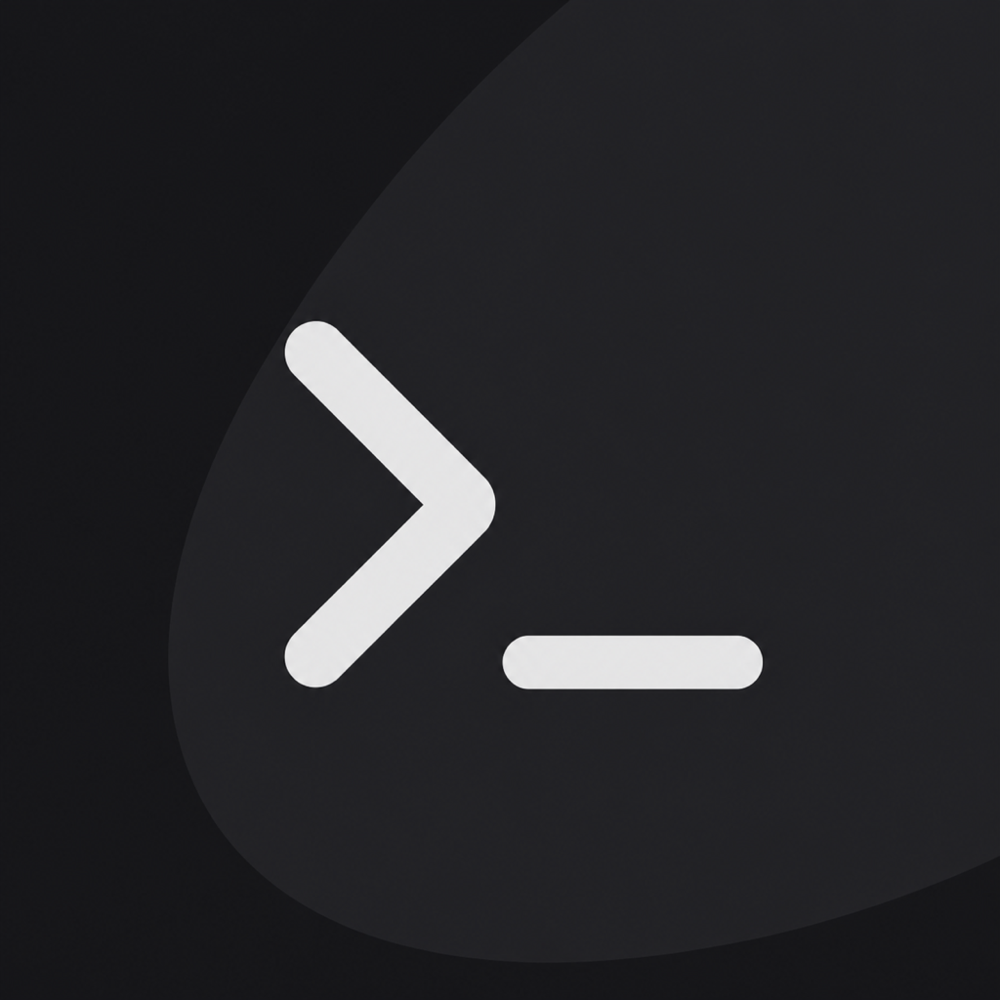

<div align="center">



# Clair

**Editor, terminal, AI agents, and Git in one native macOS workspace per project.**

[](LICENSE)


[](https://github.com/Diwamoto/clair/releases/latest)

[日本語](README.md)

</div>

<!-- screenshot: docs/images/workspace.png — overview: editor + terminal with an agent running (hero) -->

Clair is a native macOS IDE that brings the daily back-and-forth between editor, terminal, and AI agents
into **one project workspace**. It pairs a VS Code–style integrated editing, search, and Git experience
with Ghostty's terminal, built in Swift with no Electron and no WebView.

AI agents are not locked into a chat UI. Claude Code, Codex, and OpenCode run as **ordinary terminals** that you
can tile, switch between, and keep an eye on from your iPhone.

> [!NOTE]
> Clair is a personal project under active development. It covers day-to-day development; UI polish is ongoing.

## Install

On an Apple Silicon Mac, paste one line into a terminal:

```sh
curl -fsSL https://raw.githubusercontent.com/Diwamoto/clair/master/scripts/install.sh | sh
```

It fetches the latest release, checks its checksum, puts it at `/Applications/Clair.app`, and opens it.
After that, updates show up inside the app and apply with one click (signature-verified; open terminals survive the restart).

## Features

### ⚡ A fast native editor

<!-- screenshot: docs/images/editor.png — syntax highlight, diagnostics, completion popup -->

- A rope-based buffer that opens and edits 10 MiB files instantly
- Japanese IME, emoji, multi-cursor, block selection, folding, soft wrap
- tree-sitter syntax highlighting (Go, TypeScript/JavaScript, Python, Rust, Swift, Ruby, PHP, Java, Terraform, Shell, JSON, Markdown)
- Language servers: diagnostics, completion, ⌘-click / F12 go to definition, references, symbols, ⌃- to go back
- Live Markdown preview (⌘⇧V) and inline git blame

### 🖥️ Ghostty's terminal

<!-- screenshot: docs/images/terminal.png — split panes with several agents running -->

- GPU-rendered terminal powered by [libghostty](https://github.com/ghostty-org/ghostty)
- Split, move, and maximize panes freely; put editor, terminal, preview, and commit graph side by side
- Shells live in a background daemon, so sessions survive closing the window and restarting for an update

### 🤖 AI agents, still terminals

- Launch Claude Code / Codex / OpenCode side by side in the project root or a dedicated worktree
- Agent completions and notification requests become macOS notifications and per-project badges
- One-click "review this file" / "review this project" requests
- Browse agent chat history per provider and see daily usage

### 🌿 Git and worktrees

<!-- screenshot: docs/images/git.png — changes list, diff, commit graph -->

- Changes list, stage / unstage, commit, pull / push, branch switching
- Line-level review comments, and apply or reject an agent's suggested fixes
- A commit graph to follow branches and merges, straight from a commit to its diff
- Create managed worktrees for parallel branches and adopt them with a merge commit

### 🔌 Every action is a command

- Menus, the ⌘K command palette, shortcuts, the `clair` CLI, and MCP all run the same typed commands
- Assign a shortcut to any command
- When an agent drives Clair, risky operations still need approval in the GUI

### 📱 Watch agents from your iPhone (experimental)

- See the output of agents on your own Mac from an iPhone / iPad and send input back
- Pair with a QR code shown on the Mac

## Build from source

Requirements: macOS 14 or later, Xcode 16 or later (full Xcode, not just the Command Line Tools)

```sh
make doctor    # check the environment
make dev       # build and launch Clair Dev (rebuilds on Swift changes)
make test      # unit tests
```

Dev builds use a separate bundle and data directory from Stable, so they run next to an installed Clair.
See `make help` for more commands and the [local verification runbook](docs/runbooks/clair-verification.md) for manual checks.

## Documentation

- [Spec](docs/clair-spec.md) — what Clair is and is not
- [Tasks](docs/clair-tasks.md) / [Kanban](docs/clair-kanban.html) — progress
- [Release and update distribution](docs/runbooks/release.md)
- [Docs index](docs/README.md)

Development runs one task at a time from the task queue with the `/clair-task` agent skill (`.agents/skills/clair-task/`).

## Out of scope

Windows / Linux builds, real-time team collaboration, VS Code extension compatibility, a plugin runtime, and hosted agents.

## Contributing

Bug reports and bug-fix pull requests are welcome. For larger features, please open an issue first.
To report a vulnerability, see [SECURITY.md](SECURITY.md).

## License

[MIT](LICENSE). Third-party components are listed in [THIRD_PARTY_NOTICES.md](THIRD_PARTY_NOTICES.md).
