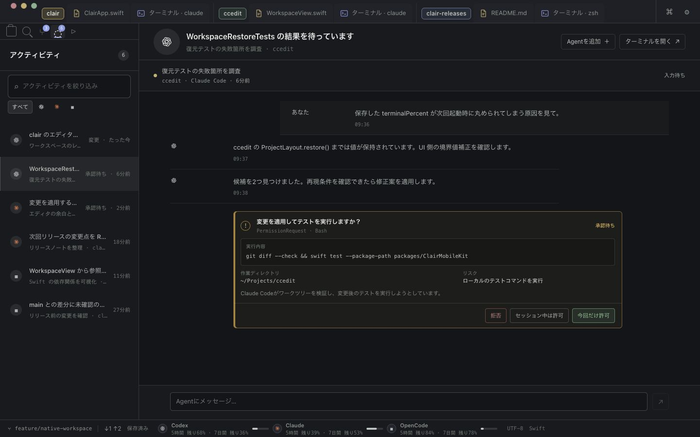
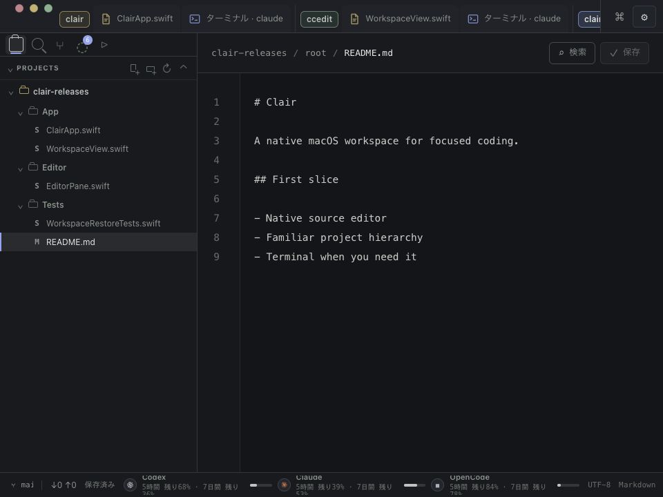
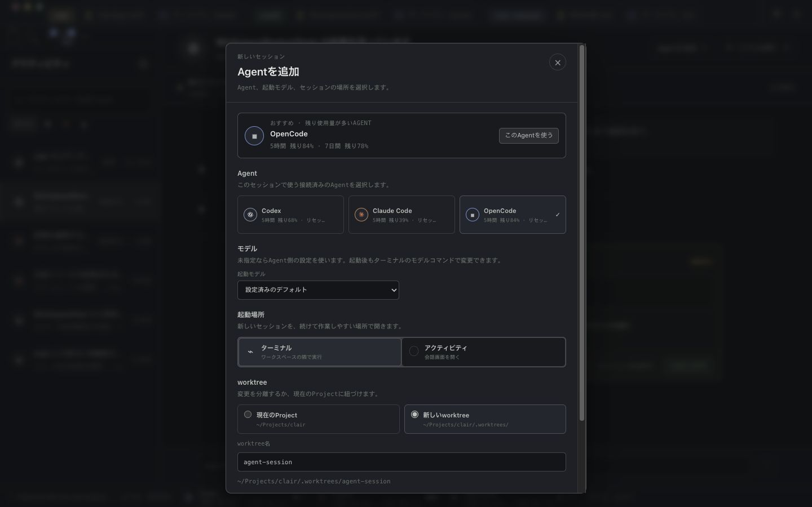
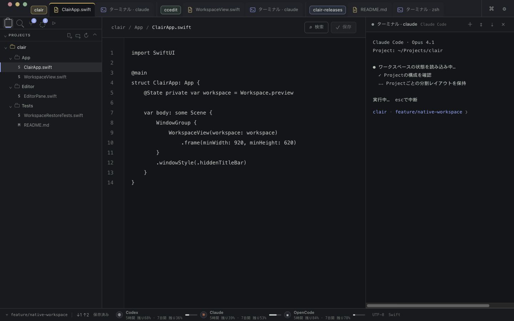

# Clair Interaction Lab UIデザインレビュー

ClairのUIには、Projectの色分け、一段のtitlebar、左navigator、editorとterminalが共有する落ち着いた外観という、維持する価値のある骨格がある。一方、現在のモックは中核の操作とdocsの思想にずれがあり、有名エディタと日常の使いやすさで並ぶ品質にはまだ届いていない、というのが今回の評価である。

優先したいのは「作業を再開したときに、対象と入力先が分かり、そのまま続けられること」。通知を確認し、該当terminalへ戻り、変更をreviewして採用するまでを、一貫したProjectの文脈で完結させることをClairの特徴にしたい。

この文書はレビューと提案であり、製品方針の変更決定ではない。モックとnativeのアプリコードは変更していない。

## Question

1. docsにあるProject所有、raw terminal、任意worktree、branch reviewという思想を、現在のモックが十分に表現しているか。
2. Orca、VS Code、Cursor、Zedを品質の参照としたとき、Clairの日常操作で優先して改善すべき点は何か。
3. 次のUI改善を判断するために、docsへどの操作仕様・品質基準を補うべきか。

## Basis and scope

判断の基準は [vision](../../clair-spec.md)、[principles](../../clair-spec.md)、[scope](../../clair-spec.md)、[ADR-0006](../../decisions/0006-adopt-project-owned-workspaces-and-optional-worktrees.md)、[ADR-0007](../../decisions/0007-unify-operations-in-a-typed-command-registry.md)、[PoC queue](../../clair-tasks.md) のP04–P12とP15C。

P15Cには、左navigator、共通One Dark token、一段のtab、core navigation、比較の `adopt / avoid / surpass`、狭い・広い画面での検証がすでに記載されている。これらを新規の提案として数えず、現在のモックで成立しているかを確認した。

[p0014](../../projects/p0014-git-review-workflow/README.md) と [p0022](../../projects/p0022-worktree-agent-orchestration/README.md) は再設計が必要なdraftと明記されている。旧worktree-first要件は現在の製品契約として扱っていない。queueではP04、P05、P06、P09、P11、P12、P15Cが `done` であり、モックの不足をnative機能の未実装と読み替えてはいけない。

## Environment and method

| 項目 | 条件 |
|---|---|
| 対象 | `prototypes/clair-interaction-lab` のローカルモック |
| モックのHEAD | `c004f05` — `Prototype Claude approval chat flow` |
| ブラウザ | Codex In-app Browser |
| 画面 | 1280×720、1440×900、960×720 CSS px |
| データ | 既存の3 Projects、5つのsample files、6つのActivity fixtures |
| 操作した範囲 | Project切替、editor単独、terminal右/下配置、terminal focus、Search、Git、Activity、Agent追加、Command Window |
| 根拠 | 実画面、アクセシビリティツリー、表示DOMの寸法、モックソース、docs |
| 検証 | HTTP 200、`npm run build` 成功、親repoとモックの `git diff --check` 成功 |

操作によるGit変更、Agentの起動・メッセージ送信・承認は実行していない。競合は2026-09-05に取得した公式資料を参照しており、4アプリで同一作業を実測した比較ではない。

ローカルpreviewは既存起動スクリプトを試した後、プロセス終了を確認し、明示した5173ポートの保持sessionで起動した。公開済みSites版はログインできなかったため、配信版とローカルHEADの一致は未確認。

## Findings

ここでのP0は「次にモックをUI受け入れ基準として使う前に整える項目」、P1は「日常利用の品質を上げる次の項目」。nativeの障害severityではない。

| 優先 | 対象 | 観測した不足 | 改善の方向 |
|---|---|---|---|
| P0 | 通知・履歴 | Activityが会話と承認を中心に構成され、Project filterがない | Project別の通知・session情報と、所有terminalへの復帰を中心にする |
| P0 | Project/tab | 非active Projectのsurfaceも常時展開され、960pxでactive file tabが隠れる | 他Projectをcompactにし、選択中tabとattentionの可視性を保証する |
| P0 | Keyboard/focus | パレットの矢印・Enterが機能せず、Project復帰時のterminal focusが失われる | 表示上のactive stateと実際の入力focusを一致させる |
| P0 | Agent起動 | 新規worktreeが既定、repo内path、会話画面への起動が選択肢にある | Project rootを通常経路にし、隔離を明示選択する短い起動フローへ |
| P1 | Paneと復元 | モックは単一editorとterminal gridで、任意mixed paneの評価ができない | 複数editor・diff・terminalを同じ操作規則で評価できる状態を追加する |
| P1 | Review | staged diffとbranch比較の見せ方が混ざり、採用までの経路が見えない | working changesとbranch reviewの目的・基準・次の操作を明示する |
| P1 | 視覚的階層 | 頻繁に読む文字が小さく、補助情報・見出しが多い | 読む文字の大きさを守り、重複するchromeと常時情報を減らす |
| P1 | 回復・状態 | dirty、外部更新、失敗、終了sessionを横断する見え方が弱い | 成功画面に加えて、状態遷移と回復導線をUI契約にする |

### 1. Activityの中心がdocsと異なる

**観測。** Activityの詳細には会話本文、メッセージ入力、Claude Codeの承認カードがある。絞り込みはvendor別で、明示的なProject filterはない。上部のactive Projectが `clair`、下部branchが `feature/native-workspace` のまま、詳細には `ccedit` のsessionと承認対象が表示される。詳細にProject名はあるが、どの範囲に各操作が効くかを一目で判断しにくい。

**意味。** docsの「raw terminalを正本とし、根拠のある通知・session metadataから戻る」という設計に対し、モックは別の会話面がある製品として読める。終了済みsessionも会話を読めるとの期待を生みやすい。これは保存実装の監査結果ではなく、UIが利用者に約束している体験の問題である。

**提案。** 常設の「通知・履歴」にProject selectorと検索を置き、sessionの生存状態、発生したevent、時刻、cwd、branch、情報の根拠を表示する。live sessionには「ターミナルへ」、終了済みには「Projectを開く」を用意する。終了したterminalの本文は表示しない。公式hook等で確認できた承認待ちはその根拠を示し、raw terminalのみのsessionに意味を推測した状態を付けない。

global一覧を許容する場合は、一覧のscopeと詳細の所有Projectを明示し、操作の対象Projectを近くに表示する。「このProject」と「すべて」を利用者が選べるようにする。

**受け入れ案。** 他Projectの通知を選んだ後、対象Projectとterminalを迷わず特定でき、1回の操作で入力可能なterminalへ戻れる。終了済みsessionは履歴本文を期待させず、保持するmetadataを読める。

根拠: [principles 1/3/8](../../clair-spec.md)、queue P09/P15C、[Activity sidebar/detail](../../../prototypes/clair-interaction-lab/app/page.tsx) の `activitySidebar`、`visibleThreads`。

### 2. 一段のtitlebarに、項目数が増えたときの規則が必要

**観測。** 3 Projectsすべてのfile/terminal tabが常に表示される。`collapsed` はstateにあるが、現在のtitlebar描画には反映されていない。960×720で3番目のProjectを選んだ状態では、tabstripの表示幅は783px、内容幅は1121pxとなった。選択中の `README.md` はx=942から1061にあり、tabstripの可視範囲外に隠れる。横scrollの存在も弱く、選択tabを表示内へ戻す動きは確認できなかった。

**提案。** active Projectのsurfaceを展開し、他Projectは名前とattention badgeを基本とする。active Project内でも、表示中paneのactive surfaceを優先し、残りは件数付きの一覧へ収める。選択tabへの自動scroll、明示的なoverflow、最近使ったsurfaceへの切替を用意する。

複数paneでは、titlebarのsurfaceと対応paneをfocus時に同時に示す。pane内はpath/cwdのheaderを使い、二段目のtab rowは追加しない。非active Projectの通知はcompactなProject labelにも残す。

**受け入れ案。** 960pxで現在のProject・選択surface・attentionが読める。5 Projects、複数editor、8 terminalsという追加fixtureでも、選択するたびに対象tabを探し直さずに済む。この大きいfixtureは今回未検証。

根拠: queue P15C、[titlebar描画](../../../prototypes/clair-interaction-lab/app/page.tsx) のreturn部分、[titlebar CSS](../../../prototypes/clair-interaction-lab/app/globals.css) の `Project names are labels` 以下。

### 3. Keyboardとfocusは外観と同じ優先度で扱う

**再現した問題。**

- Command Windowで `設定` と入力し、↓、Enterを押しても実行されない。画面には「↑↓で移動」「↵で実行」と表示されている。
- `ccedit` のterminal tabを選ぶと入力fieldへfocusする。別Projectへ移り、Project labelから戻ると、見た目はeditorがactiveになり、実focusはProject labelに残る。
- Agent追加dialogを開いた直後もfocusは背後の「Agentを追加」buttonに残り、Escapeで閉じられない。

**提案。** Project復帰で最後に使っていたpane・surface・入力focusを復元する。paletteは検索中の選択行、↑↓、Enter、Escape、閉じた後のfocus返却を一つの契約として扱う。modalは開いたときに内部へfocusを移し、Tab移動を内部に保ち、閉じたら起点へ戻す。

現在のCmd+Pはcommand検索へ入る。fileのQuick Openとcommand検索の入口・初期modeを定義する必要がある。既定案はCmd+Pでfile、Cmd+Shift+Pでcommand。同じCommand Windowの見た目・検索部品を共有し、利用者のshortcut変更に対応する。

**受け入れ案。** マウスを使わず、fileを探す、terminalへ移る、別Projectを確認する、元の入力へ戻る、の一連の作業が完結する。terminalへ復帰した直後の入力が期待するsessionに届く。

根拠: [page.tsx](../../../prototypes/clair-interaction-lab/app/page.tsx) の `activateProject`、`openTerminal`、`onKeyDown`、Command Window、`AddAgentWindow`。現在のkeyboard handlerにはpaletteの矢印/Enter処理がない。

### 4. Agent起動は通常のProject作業を最短にする

**観測。** Agentは残り使用量の重み付きscoreで推奨・初期選択される。worktreeは「新しいworktree」が初期値で、pathは `~/Projects/clair/.worktrees/…`。起動場所にはterminalとActivityの会話画面が並ぶ。1440×900でもフォームが縦にscrollし、初期表示では起動buttonが見えない。

**意味。** ADR-0006の「worktreeを既定または必須にしない」「managed worktreeをProject外へ置く」と不一致。会社と自宅で使うCLIが異なるというvisionに対して、使用量だけで選ぶ既定も、いつもの作業を妨げる可能性がある。

**提案。** 第一画面には「使用するlaunch profile」「対象Project/root」「起動」を置く。既定は利用者が設定したprofileと現在のProject root。worktree作成、モデルoverride等は必要時に展開する。隔離する場合はbranch/baseを明示し、保存場所はClair管理領域として示す。起動buttonは常に見えるfooterへ置く。

残り使用量は選択を助ける補助情報とし、既定を自動で変えない。一般CLIに意味が保証されない「実装／review／debug」や「変更前に確認」は、対応profile/capabilityがある場合にだけ提示する。

**受け入れ案。** 通常rootでいつものAgentを起動する操作が短く、隔離の有無とcwdを実行前に説明できる。非Git Projectでも同じ通常経路を使える。

根拠: [ADR-0006](../../decisions/0006-adopt-project-owned-workspaces-and-optional-worktrees.md)、[AddAgentWindow](../../../prototypes/clair-interaction-lab/app/page.tsx)。

### 5. Mixed paneと編集の継続性をモックでも評価可能にする

**観測。** モックのProjectは `activeFile` 一つとterminal配列を持ち、中央は単一editorとterminal grid。docsの複数editor・diff・terminalが混在する任意split、移動、最大化、均等化を評価できる構造になっていない。

また、未保存編集は `codeDraft` に置かれ、`openFile` と `activateProject` は保存済みdraft/sampleを読み直してdirtyを解除する。ソース上、通常のfile/Project切替でも未保存内容を保持しない。これは静的確認であり、今回は編集による再現試験を行っていない。diskの外部変更時に履歴を残してreloadするというproductの規則とは別の問題である。

**提案。** editor二面＋terminal、editor＋diff＋terminal、terminalのみ、という実作業の配置を追加する。すべてのsurfaceでfocus、移動、close、最大化、復帰の規則を共通にする。tab/Projectの切替はbuffer、selection、scroll、dirtyを保持する。disk-wins reloadは別の状態として、置換前bufferの履歴と復元導線を見せる。

**受け入れ案。** 3 Projectsで異なるlayoutを作り、戻った直後に編集を続けられる。paneを一時的に最大化し、元の比率へ戻せる。未保存bufferの状態が他fileへ漏れない。

P04/P05/P06のnative実装はqueue上では完了している。ここで必要なのは、機能をゼロから設計し直すことではなく、その操作を評価できるモックへ追いつかせることである。

### 6. Branch reviewから採用までを一つの流れにする

**観測。** Git sidebarにはstaged/unstaged一覧があり、中央上部には `feature/native-workspace → main`、file headerにはstagedとbranch比較の両方が表示される。差分基準の違いが分かりにくい。常設navigationに独立したReviewはなく、main viewにもbranch採用、dirty gate、conflictからの復帰を評価する経路がない。

**提案。** 「ソース管理」は手元のworking/stagedの操作、「Review」はbaseからbranch全体の成果を読む入口として役割を定める。Reviewには対象Project・execution root・base→head・比較対象の更新時点をまとめて示し、commit済みと未commit/untrackedを分ける。

通常経路は、branch選択 → 差分確認 → 未commitがあればcommitへ → 対象を確認してmerge commitで採用 → 必要ならcleanup。conflict時はnative merge editorまたは所有Agentへ戻す。各画面に、その状態で意味のある次の操作を一つ示す。

行コメントやAI briefは魅力的だが、queue P11では後続扱いになっている。まず既定のadoption経路を完成させ、コメントUIはそれに接続する。

**受け入れ案。** 利用者が「どこからどこまでの差分か」「何が未commitか」「採用できない理由」「次に何をすればよいか」を画面から説明できる。review中に対象revisionが更新された場合、確認済み状態を黙って使い回さない。

根拠: [principles 6](../../clair-spec.md)、queue P11/P15C、[モックGit描画](../../../prototypes/clair-interaction-lab/app/page.tsx)。

### 7. 文字を読みやすくし、chromeの密度を整理する

**観測。** 1440px時のProject labelは12px、surface tabは12.5px、file treeのfileは12px。使用量の内訳はCSS上10pxで、常時3vendor・各2期間が並ぶ。editorは14.5pxが基準で行高28px。小さい補助文字と広いコード行間が併存し、情報量の配分が均一ではない。Searchのmatch抜粋も固定幅sidebar内で強く省略される。

**提案する出発点。** 数値は今回の推奨値であり、普遍的な基準や競合の実測値ではない。

| 項目 | 推奨する方向 |
|---|---|
| UI type | system fontを継続。file/tab/action等は13px前後を出発点とし、UI文字サイズを独立して調整可能にする |
| 補助metadata | 常に読ませるものは12px程度を出発点とする。収まらない詳細はpopover等で読めるようにする |
| editor/terminal | 同じmono familyと基本サイズを共有し、行高を22–24px程度から比較する。利用者が調整できるようにする |
| surface | canvas、sidebar、浮いたoverlayの役割を既存の暗色palette内で揃える |
| active/focus | Project色は所有関係、focusはpane/入力先、amberはattention、redはerrorに使い分ける。形やlabelも併用する |
| status bar | 現在のProject/branch、focusに対応する状態、必要なattentionを優先。全vendorの使用量は一つの入口から確認できるようにする |
| header | file名やterminal名の反復を整理し、pane headerにはpath/cwd等の判断に必要な補足を置く |
| icons | 文字glyphとSVGの大きさ・線の太さ・optical alignmentを揃える。通常controlのhit areaは見た目より広くする |
| Search | sidebar幅を調整可能にし、file名を守り、pathとsnippetの省略順を定める。長い検索結果はpaneにも開ける |
| motion | hoverで全buttonが縮小・減光する共通効果は弱め、色・押下反応・直接操作中の追従を中心にする |

One Darkの落ち着き、quiet border、選択tabがworkspaceへつながる形は維持したい。読みやすさと密度は、文字を小さくする量だけでは決まらない。何を常時表示し、何を必要時に開くかを先に整理する。

### 8. 回復可能性と「分からない状態」を画面へ落とす

**観測。** 現在のモックでは成功・会話・承認fixtureが強い一方、file historyを開く明確な導線、外部reload時の回復、Agent非対応/起動失敗、終了済みsession metadataといった状態の評価が不足している。現在のモックの全領域・全例外を網羅した監査ではない。

**提案。** 次の状態を再現できるfixtureを用意し、表示する情報と回復先を明文化する。

| 状態 | 画面に必要なこと |
|---|---|
| fileの外部更新 | 更新された事実、上書き前bufferが履歴にあること、「履歴を開く」 |
| 未保存buffer | Project/tab単位のdirty、切替での維持、close時の適切な確認 |
| raw terminalが生存 | 「実行中process」と、根拠があるsemantic eventを区別する |
| Agentの状態が取れない | 不明を許容し、最後の更新時刻・情報源を表示する |
| process終了 | exit code、時刻、cwd、Projectへの復帰。終了本文は保存しない |
| Agent起動失敗 | 実行profile、cwd、失敗理由、設定修正または再試行 |
| review対象の更新 | 比較の更新と再確認の必要性、staleな確認への説明 |
| 非Git Project | Files/terminalは通常どおり使え、Git操作が使えない理由を近くに示す |

## Competitive references

以下は公式資料に示されたpatternと、Clairへ取り込む際の提案を分けたもの。製品全体の優劣を判定した表ではない。

| 参照先 | 公式資料から確認できたpattern | Clairへの提案 |
|---|---|---|
| VS Code | editor group、tab操作、layout復元、Command Palette、文脈に応じたstatusという基本構成。[User interface](https://code.visualstudio.com/docs/editing/getting-started/userinterface) | file探索、移動、close、focusを予測できる日常操作の完成度を基準にする |
| Orca | surface種別を跨ぐnested split、active-pane表示、保存されたlayout。[Tabs and panes](https://www.onorca.dev/docs/model/tabs-panes-splits) | direct manipulationと復帰を取り入れ、所有単位はClairのProjectを維持する |
| Orca | keyboardによるfile/tab/worktree移動、通知から該当paneへjump。[Quick Open](https://www.onorca.dev/docs/model/quick-open)、[Notifications](https://www.onorca.dev/docs/notifications) | Projectとsessionが増えたときの移動、attentionからの復帰を強くする。状態表示にはClair自身の信頼できる根拠を使う |
| Cursor | 作業中のdiff確認、branch全体の文脈、Agent作業後のreview導線を公式に説明している。[Reviewing and testing code](https://cursor.com/learn/reviewing-testing) | raw terminalからbranch reviewへの遷移を近くし、差分の基準と採用結果を読みやすくする |
| Zed | UIとbufferの文字サイズを独立設定し、terminalは既定でeditorの文字サイズに合わせる。[All Settings](https://zed.dev/docs/reference/all-settings) | compactさを固定の小さい文字へ依存させず、UIの読みやすさとcodeの密度を個別に調整できるようにする |

Clairが狙う独自の強みは、**raw-terminal Agentと自分の編集作業を、Projectへ戻るだけで再開できること**。そこに「通知 → terminal → branch review → 採用」を接続する。特定vendorのchat UI、必須worktree、大きい常設dashboardへ寄せる必要はない。

## What to add to docs

productの存在理由とscopeは明確である。補強すべきなのは、原則を画面・状態遷移・合否へ変換する短い仕様である。

| 追加する仕様 | 決める内容 | 既存docsとの関係 |
|---|---|---|
| Workspace interaction contract | Project/tab/paneの所有、activeとfocus、切替後の復元、overflow、drag、close/最大化/復帰 | P05/P15Cをユーザー操作の粒度へ具体化する |
| State and attention contract | process状態・hook event・不明・dirty・review済みの意味、badgeの優先順位、既読/mute、復帰先 | principles 3/8とP09を画面へ落とす |
| Command interaction contract | Quick Openとのmode分担、keyboard、利用不可の理由、parameter入力、error、focus返却 | ADR-0007/P12のUI側の仕様を補う |
| Visual specification | type scale、density、surface、semantic colors、iconサイズ、focus、reduced motion | P15CのOne Dark contractの基準値を固定する |
| Workflow acceptance matrix | 代表的な作業、開始状態、完了状態、途中の迷い、画面幅、根拠画像 | P15Cにある比較matrixを継続運用できる形へする |

ファイル名の案は `docs/design/interaction-contract.md`、`docs/design/visual-system.md`、`docs/design/workflow-acceptance.md`。今回これらは作成せず、提案の採用後に現在の決定だけを書く。

特に、queueでP15Cがdoneになった時点のモックと、その後のモック変更を区別できるようにしたい。UI受け入れ記録にはモックcommit、native commit、確認した状態、幅、画像を組にして残す。現在のモックの外観やflowを無条件に次のnative受け入れ基準へしない。

## Suggested next slices

1. **中核の整合。** Notifications/History、Project filter、所有対象の明示、通常rootからの短いAgent起動を揃える。
2. **移動と再開。** Project collapse/overflow、keyboard palette、focus復元、mixed paneの共通操作を完成させる。
3. **変更の確認と回復。** branch review/adoptionと、dirty・外部更新・履歴・失敗の導線を揃える。
4. **視覚的な仕上げ。** 上の実作業を同じデータで行いながら、文字・余白・icon・status・動きを調整する。

完了条件の案:

- 960pxと1440pxの両方でactive Project・surface・attentionを特定できる。
- 別Projectを確認して戻った直後に、元の入力先で続きを打てる。
- 代表的なfile/terminal/Project移動がkeyboardだけで完結する。
- Agent起動の通常経路で、画面scrollや毎回のworktree選択を必要としない。
- 通知から所有terminalへ1回で戻れる。
- branchの差分基準、未commit、採用できない理由と回復先を説明できる。

これらは今回の達成結果ではなく、次の改善の受け入れ案である。正式なperformance計測は既存方針どおりL01へ残し、各sliceでは操作の成立を確認する。

## Limitations

- native Clairは起動・操作・変更していない。この文書からnative実装の不具合を断定できない。
- 実PTY、CLIごとのhook、外部file変更、disk history、Git merge、更新時reattachは試験していない。
- large repository、多数session、長時間作業、IME、VoiceOver、文字拡大、mobileは今回の実操作レビューの対象外。
- 競合のlatencyや使いやすさを同じ条件で測っていない。比較は公式資料を基にしたpatternの参照である。
- 公開版へのサインインは自動承認レビューで拒否され、公開版の実画面は確認できていない。今回の根拠画像はローカルHEADのもの。
